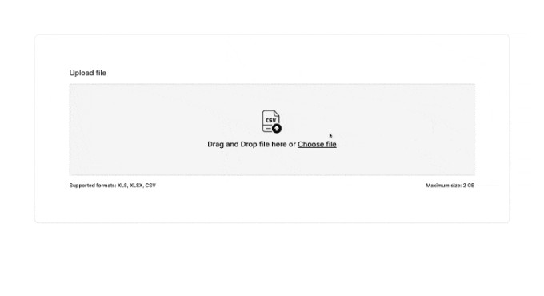

# Rhombus Type Inference

This is a project is used for Rhombus AI Technology Assessment round. The target is to build a system 
that can infer the data types of the given data (CSV, Excel). The system is built to ensure scalability,
reliability, and maintainability. For more details, please check the [System Design](docs/pages/system-design.md) page.



## Prerequisites
- [Docker](https://docs.docker.com/get-docker/)
- [Docker Compose](https://docs.docker.com/compose/install/)

The following are optional if you want to run the project locally:
- [Node.js](https://nodejs.org/en/download/) for running the frontend and Storybook
- [Pnpm](https://pnpm.io/installation) for managing the frontend dependencies
- [Python 3.11](https://www.python.org/downloads/) for running the backend
- [Poetry](https://python-poetry.org/docs/) for managing the backend dependencies

## Starting the demo

Run the following command in the root:

```sh
docker-compose up -f docker-compose.demo.yml
```


For cleaning up the demo run:
```sh
docker-compose down -f docker-compose.demo.yml
```

## What's inside?

This project is a monorepo built with [Turborepo](https://turbo.build/repo), which includes the following packages/apps:

### Apps and Packages

- `workshop`: a [Storyboard](https://storybook.js.org) app with [Tailwind CSS](https://tailwindcss.com/) for UI development and testing
- `web`: a [Next.js](https://nextjs.org/) app with [Tailwind CSS](https://tailwindcss.com/) for hosting the main application
- `backend`: a [Django](https://www.djangoproject.com/) app for the backend API and inference of data types
- `ui`: a stub React component library with [Tailwind CSS](https://tailwindcss.com/) shared by both `web` and `workshop`
  applications
- `@repo/eslint-config`: `eslint` configurations (includes `eslint-config-next` and `eslint-config-prettier`)
- `@repo/typescript-config`: `tsconfig.json`s used throughout the monorepo
- `@repo/config-tailwind`: `tailwind.config.js` used throughout the monorepo

### Starting the development environment

There are two ways to start the development environment:
- Using Docker Compose
- Running the services locally

#### Using Docker Compose (Recommended)

To start the development environment using Docker Compose, run the following command in the root:

```sh
docker-compose up -f docker-compose.dev.yml
```

**Note**: An ssh server is already setup in backend service, so you can connect to the Python environment using Pycharm and all the dependencies are already installed.
For running the tests via Pycharm test suite, you should make sure that environment variable `DJANGO_SETTINGS_MODULE` is set to `app.test_settings` and the path mapping is set to the
`/app` path, eg: `~/path_to_this_project_in_local/apps/backend=/app`.

#### Running the services locally

For each services, please check the README.md in the respective directories. However, you can run the following commands to start the services:

For the frontend services:
```sh
cd path_to_app
pnpm install
pnpm dev
```

For the backend services:
```sh
cd apps/backend
poetry install
poetry run python manage.py runserver
```

### Documentations

The following pages show the details and the design decisions made for this project:

| Topics                                         | Details                      |
|------------------------------------------------|------------------------------|
| [API](docs/pages/api.md)                       | API documentation            |
| [System Design](docs/pages/system-design.md)   | System design documentation  |
| [Type Inference](docs/pages/type-inference.md) | Type inference documentation |

