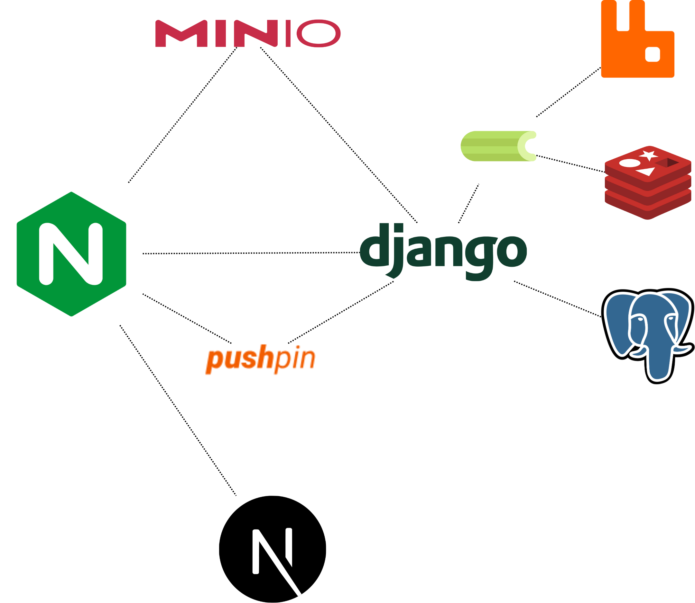

# Rhombus Type Inference Design Document

## Table of Contents

1. [Introduction](#introduction)
2. [Design](#design)
3. [Testing](#testing)
4. [Future Work](#future-work)

## Introduction

The requirements for the Rhombus Type Inference system are to infer the types of data in a given CSV/Excel file.
The only requirements are that the system should be able to handle CSV and Excel files, and that it should be able to
infer the types of data in the file.

Thus, the requirements are as follows:

### Functional Requirements

1. The system should be able to handle only CSV and Excel files.
2. The system should be able to infer the types of data in the file.
3. The system should have an UI that allows the user to upload a file and see the inferred types.

### Non-Functional Requirements

1. The system should be able to handle large files.
2. The system should be able to handle multiple files at once.
3. The system should be able to asynchronously process the files.
4. The system should be able to withstand occasional failures.
5. The system should be able to scale horizontally.

To meet the functional requirements, the system will be fairly simple.
It will only need an UI that allows the user to upload a file and  
a Django backend that will handle the file upload and type inference.

However, this design is not scalable. It will faces the following issues:

1. It will have to store all the files in the server, which will increase the size of the server, reduce disk space, and
   increase the cost.
2. It will have to process the files synchronously, which will increase the time taken to process the files, especially
   when the server is running
   with Python's GIL.
3. It will be a single point of failure, as the server will have to handle all the requests.
4. It is not horizontally scalable, as the server will have to handle all the requests.

Therefore, I present a scalable design that will meet the non-functional requirements as well.

## Design

### Architecture

The system will be divided into three parts:

1. **Frontend**: The frontend will be a simple React app (NextJS-backed) that will allow the user to upload a file.
2. **Event-Driven Backend**: The backend will be an event-driven system that will update every state change to an
   inference request.
3. **Inference Engine**: The inference engine will be a separate service that will handle the inference of the types of
   data in the file.

The architecture will look like this:



I will explain each service in detail.

### Frontend (NextJS/React)

The frontend will be a simple `NextJS` app that will allow the user to upload a file.
But it also needs to update the state of the request as I don't want the user to wait for the request to finish.
Therefore, I will use `Server-Sent Events (SSE)` to update the state of the request in real-time.
A common pattern is to use `WebSockets` for real-time updates, but I don't want to maintain a connection between
the client and the server and I don't need bidirectional communication.

Because `SSE` is required, I will also adopt `pushpin` as a reverse proxy that will handle the `SSE` connections. It is
a simple reverse proxy that is written in C and focuses on `SSE` connections.

For maintaining the state of the request, I use a combination of `React Context` and `zustand`. `React Context` will be
used
to maintain the global state of the application, while `zustand` will be used to maintain the state of the request.

For form handling, I will use `react-hook-form`.

### Event-Driven Backend (Django/Celery/Transitions)

I designed the backend to be event-driven to handle the asynchronous processing of the files.

Every request will be assigned an unique ID, this ID will be used to track the state of the request.
So if the user closes the browser, he can still fetch the state of the request using the ID. One thing to
note is that the ID will be an `ULID` (Universally Unique Lexicographically Sortable Identifier) instead of a UUID.
This is because `ULID` is more space-efficient and is lexicographically sortable. Because it is lexicographically
sortable,
database indexes will be more efficient during insertion, `Postgres` would not need to reindex the table after every
insertion.

I use `transitions` to handle the state of the request. The entire process can be modeled as a state machine, and
`transitions` is a simple library that allows me to model the state machine. It provides a flexible way to model the
state machine and the events that can trigger the state change. However, I have remodeled the event dispatching to be
easier to write and maintain.

The process is strictly linear, so I don't need a complex state machine. The states will be as follows:

1. `INIT`: The request is initialized.
2. `GENERATE_PRESIGNED_URL`: The request is generated and the presigned URL is sent to the client.
3. `UPLOAD_FILE`: The file is uploaded to the presigned URL. (This state will be moved automatically by the webhook of
   MinIO)
4. `VALIDATE_FILE`: The file is validated to check if it is a CSV or Excel file.
5. `INFER_TYPES`: The types of data in the file are inferred.
6. `SUCCESS`: The types of data are inferred successfully.
7. `ERROR`: An error occurred during the process.

One thing to note here is that I have a `GENERATE_PRESIGNED_URL` state. This is because I don't want the client to
upload the file directly to the server. It is a bad practice to upload the file directly to the server, as it can
overwhelm the server and can be a security risk. Therefore, I will use `MinIO` to generate a presigned URL that will
allow the client to upload the file directly to `MinIO`. Furthermore, `MinIO` is S3-compatible, so it will be easy to
migrate to S3 if needed.

During the `VALIDATE_FILE` state, I do not check for file extension. As a matter of fact, I save the file with a random
name and check the `magic number` of the file to determine if it is a CSV or Excel file. This is because the file extension
can be easily changed, and I don't want to rely on the file extension to determine the type of the file.

The heaviest task is the `INFER_TYPES` state. Therefore, I will use `Celery` to handle the task asynchronously. `Celery`
is a distributed task queue that will allow me to handle the task asynchronously. I will use `RabbitMQ` as the broker and
`Redis` as the result backend for `Celery`.

During the `INFER_TYPES` state, I read files with `pandas` in chunks to reduce memory usage. This is because reading the
file in one go can lead to memory issues, especially when the file is large. However, the previous chunks somehow are still
persisted in memory, so I will use `gc.collect()` to collect the garbage manually as `OOM Killer` can kill the process
when the memory is full.

## Testing

I will use `Jest` and `React Testing Library` to test the frontend. I will use `Django Test` to test the backend. 

During development, I set up a `Storybook` for the frontend to test the components in isolation.

You can run the tests by running the following command:

```bash
# Frontend
pnpm test

# Backend
poetry run python manage.py test
```

Remember to set the correct test file and prepare environment variables for the backend.
I suggest following the [Setting Up Steps](../../README.md#starting-the-development-environment) section to set up the environment variables.

## Future Work
- [ ] Set up a CI/CD pipeline (I can already do this but I ran out of Github credits for other projects).
- [ ] Set up a distributed tracing system (I can use `Jaeger` for this).
- [ ] Set up a monitoring system (I can use `Prometheus` and `Grafana` for this).
- [ ] Set up a logging system (I can use `Elasticsearch`, `Logstash`, and `Kibana` for this).
- [ ] Improve the inference algorithm, I was thinking of using a scoring system to determine which type should be apply instead of 
running all the strategies. But for now, I will use the current algorithm.
- [ ] More tests, integration tests
- [ ] More documentation
- [ ] More ...


